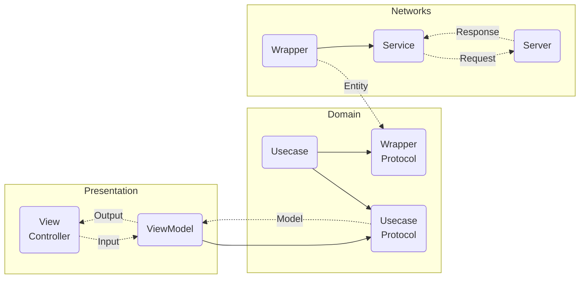
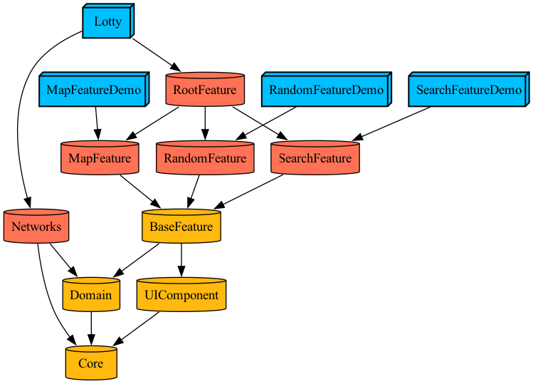

## 로또의민족 
> `2022.01 ~ Now` [‎앱스토어 바로가기](https://apps.apple.com/kr/app/로또의민족/id1615526962)

 <br>

로또의 민족은 당첨 정보를 조회하고, 번호를 생성할 수 있는 로또 유틸리티 서비스 입니다. <br>

최신 회차 당첨 정보 조회, 주변 판매점 위치 확인, 번호 생성을 할 수 있는 서비스 입니다. <br>

번호를 생성하여 행운을 시험해보세요 ! <br>

<br>

### ⚙️ 개발 환경 및 라이브러리

 


[]()  

<br><br>


## ✨ 기능 소개

### 당첨 정보 조회
- 최신 로또 회차의 당첨 정보를 확인할 수 있어요.
- 검색해서 특정 회차의 당첨 정보를 확인할 수 있어요.
- QR 코드 스캐너로 구매한 로또의 당첨 정보를 확인할 수 있어요.

### 주변 로또 판매점 조회
- 현 위치를 기반으로 주변 로또 판매점을 조회할 수 있어요.
- 특정 지역의 판매점을 검색할 수 있어요.
- 길찾기 버튼을 누르면 판매점까지 경로를 알려줘요.

### 랜덤 번호 생성
- 랜덤으로 로또 번호를 생성할 수 있어요.
- 느낌이 좋은 번호가 나왔다면 로또를 구매하러 가볼까요?

<br>

|당첨 정보 조회|회차 검색|QR 코드 스캔|
|:-:|:-:|:-:|
||||

|주변 판매점 조회|랜덤 번호 생성|
|:-:|:-:|
|||

<br><br>


## 📚 스킬

### Clean Architecture + MVVM(I/O)

```
- Network Layer: 서버 또는 로컬에서 직접적으로 데이터를 가져오거나 보내는 책임
- Domain Layer: 앱의 비즈니스 로직에 대한 책임
- Presentation Layer: UI 로직에 대한 책임
```

- Feature, Domain, Network Layer를 분리하여 각 Layer의 역할을 나누었습니다.
- 분리된 Layer의 역할과 책임이 명확해져 코드 응집도가 높아지고, 테스트에 용이해집니다.
- 특정 코드가 어떤 Layer에 있을지 예측할 수 있어, 코드의 가독성과 개발 효율이 높아집니다.

<br>

- MVVM 패턴으로 UI 로직과 비즈니스 로직을 분리했습니다.
- ViewModel에서 사용자의 이벤트와 화면에 보여질 데이터를 Input Output 구조로 정의했습니다.

<br>

### Modularization (Tuist)


- 비슷한 책임을 갖는 코드(클래스, 패키지, 라이브러리 등)를 모듈로 분리하여 응집도가 높고 결합도가 낮은 코드를 구현하도록 했습니다.
- 모듈 간 의존 관계를 설정함으로써 역할과 참조 관계를 명확히 구분해줌으로 결합도를 낮추고 실수를 방지해 유지 보수에 용이해집니다.
- 만들어 놓은 모듈은 다른 프로젝트에서도 재사용할 수 있어 개발 효율이 높아집니다.
- 데모 앱을 통해 테스트 환경을 구축할 수 있습니다.

<br><br>
